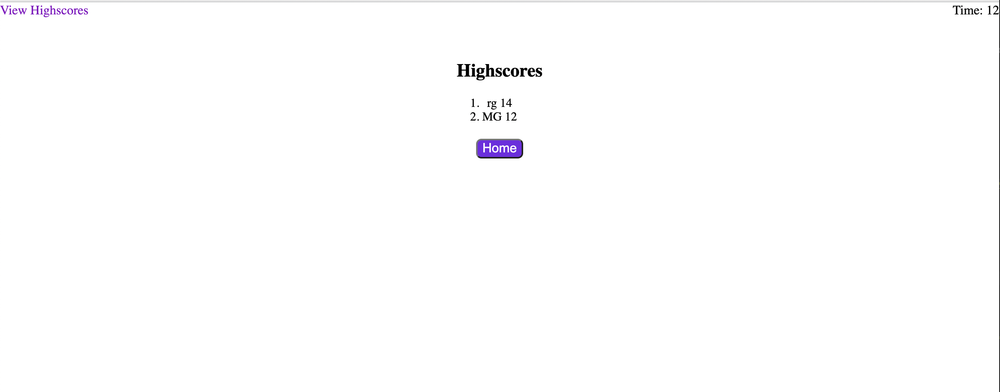

# 04 Web APIs: Code Quiz

A quiz on Coding. 
When started you will have 75 seconds to complete the quiz, however when you get a question wrong 10 seconds will be subtracted.
When you have completed the allot time or have finished cycling through the questions then you will be taken to the All done page where you can enter your initals to be placed on a highscores list.
From the highscore list you will be able to go back home and re take the quiz or click view high scores and see the list.

## Mock-Up

The following images demonstrate the web application's appearance and functionality:

